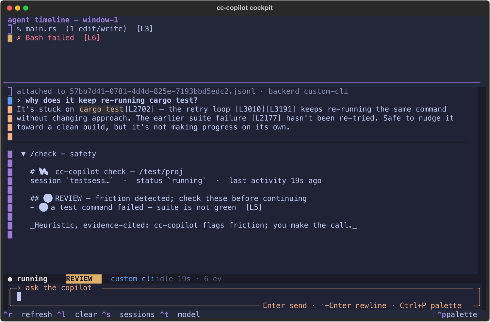

# CC-Copilot

**CC-Copilot helps you stay aligned with AI coding agents.**

Cockpit is the primary TUI experience: a live supervision layer for ongoing
agentic work, shared context, and next decisions.

Ask questions across one session, selected sessions, or an entire project
without injecting supervision chatter into the main Claude Code or Codex
workflow.



## Quick Start

```bash
cc-copilot cockpit
```

Inside Cockpit:

```text
/sessions   choose one or more agent sessions (incl. your own live session)
/here       observe the session you're running inside of
/observe    attention queue and next human decision
/since      what changed since you last looked (or 30m / 2h)
/handoff    shareable Markdown handoff (brief + what changed)
/brief      deterministic recap with citations
/check      safety / off-track verdict
/diff       changes since last turn
/model      choose backend/model
/resume     resume a Cockpit Session
```

## Install

Current install:

```bash
python3 -m pip install --user "cc-copilot[tui] @ git+https://github.com/Audiofool934/cc-copilot.git"
cc-copilot setup
cc-copilot cockpit
```

Core requirements: Python 3.9+. The CLI core is dependency-free; Cockpit uses
the optional Textual extra.

On fresh Debian/Ubuntu servers, setup may need Python's venv package:

```bash
sudo apt-get update
sudo apt-get install -y python3-venv python3-pip
cc-copilot setup
```

Target install experience:

```bash
npm install -g cc-copilot
cc-copilot cockpit
```

That npm wrapper is planned distribution work; the current supported install is
the Python package from GitHub.

## Why CC-Copilot

Past copilots reduced the cognitive burden of understanding code.

Agentic coding creates a new burden: understanding what agents are doing over
time. Long-running Claude Code, Codex, and multi-agent workflows produce
continuous context, decisions, tool calls, errors, and partial progress.

CC-Copilot gives humans a separate supervision layer. You can inspect, ask,
compare, and realign without interrupting the working agent or forcing yourself
to reconstruct context manually.

## What Makes It Different

1. **Read-only supervision**
   CC-Copilot observes agent transcripts and project context without editing
   files, issuing agent actions, or interfering with the working agent.

2. **Separate Cockpit workflow**
   Ask supervision questions outside the main agent conversation, so the
   agent's working context stays clean.

3. **Evidence-grounded answers**
   Answers are grounded in transcript lines, tool results, project facts, git
   state, and file evidence.

4. **Multi-session awareness**
   Follow one session, selected sessions, or an entire project from one
   interface.

5. **Attention-first UI**
   Cockpit surfaces status, risk, progress, and the next human decision instead
   of forcing you to read the whole transcript.

6. **Model-flexible**
   Use Codex, Claude, OpenAI-compatible APIs, DeepSeek, OpenRouter, Ollama,
   Gemini, or custom CLI backends.

7. **Terminal-native**
   Keyboard-first TUI with mouse support, designed for side-window and
   CMUX-style workflows.

8. **Resumable Cockpit Sessions**
   Your supervision conversation is independent from the agent session and can
   be resumed later.

## Usage

```bash
cc-copilot cockpit                 # open the TUI
cc-copilot sessions                # list project sessions
cc-copilot status                  # fleet board, neediest first
cc-copilot observe                 # attention queue
cc-copilot brief                   # deterministic recap
cc-copilot check                   # safety verdict
cc-copilot since                   # what changed since you last looked
cc-copilot since 30m               # …or within a time window
cc-copilot handoff --out h.md      # shareable Markdown handoff
cc-copilot watch --notify          # desktop alert when the agent needs you
cc-copilot ask "what changed?"     # one-shot grounded Q&A
cc-copilot chat                    # plain terminal chat mode
cc-copilot resume                  # resumable Cockpit Sessions
```

Scope options:

```bash
cc-copilot cockpit                 # one agent session by default
cc-copilot cockpit --scope multi   # selected/all sessions in this project
cc-copilot cockpit --scope project # project-level evidence context

cc-copilot ask --scope multi --scope-sessions a1b2c3d4,b5c53c29 "compare these"
cc-copilot observe --scope project
```

Session discovery spans every coding agent with sessions on this machine:

```text
${CLAUDE_CONFIG_DIR:-~/.claude}/projects/<encoded-cwd>/<session>.jsonl   # Claude Code
${CODEX_HOME:-~/.codex}/sessions/YYYY/MM/DD/rollout-*.jsonl              # Codex
```

A project's sessions from both agents appear on one board, grouped by project
cwd and tagged with their agent. Restrict the set with `--agent claude`,
`--agent codex`, `$CC_COPILOT_AGENTS`, or `[agents] enabled` in the config.

By default, commands report on the most recent session other than the current
one, so running CC-Copilot from inside a live agent session watches the agent
you want to supervise. To watch your **own** current session instead, use
`--here` (e.g. `cc-copilot cockpit --here`) or `/here` inside the cockpit — it is
also always listed in `/sessions` as "your live session", even across projects.
See [docs/cross-model-adapters.md](docs/cross-model-adapters.md).

## Cockpit

Cockpit is the main product surface.

It gives you:

- Status header for project, evidence range, Cockpit Session, backend, and risk.
- Live activity strip from the observed session(s).
- Attention queue and next human decision via `/observe`.
- Grounded chat over one session, selected sessions, or project evidence.
- Context HUD showing estimated input context, output estimate, and evidence
  split across raw transcript, project facts, chat, memory, and summary index.
- Background alerts when the agent stalls, errors, or goes off track.
- Checkbox session picker with `[ ]` / `[x]` multi-select.
- Resumable Cockpit Sessions via `/resume`.

Keyboard is primary; mouse works too. Click anywhere to return focus to the
composer. `Enter` sends, `Ctrl+J` inserts a newline, `/` opens command
suggestions, and `Ctrl+P` opens the command palette.

## While You Were Away

The hardest part of supervising long-running agents is *re-entry*: you stepped
away, the agent kept working, and now you have to reconstruct what happened.

- **`since`** answers "what changed since I last looked" — a deterministic,
  cited diff of new asks, agent messages, commands, failures, changed files, and
  any status/safety transition. cc-copilot remembers where you last looked (a
  small marker under `$CC_COPILOT_STATE_DIR`, never under `~/.claude`/`~/.codex`);
  the cockpit stamps it when you leave and greets you with "⟳ N new since you last
  looked" when you return. Or scope by time: `since 30m`, `since 2h`.
- **`handoff`** turns the current state into a shareable Markdown document — the
  brief plus an optional "while you were away" section — to paste into a ticket
  or hand to a teammate. Every line keeps its `[L…]` citation.
- **`watch --notify`** pings you (desktop notification, terminal-bell fallback)
  only when a session *crosses into* needing you — a fresh intervene verdict, a
  slide into stalled, or a new failure — so you can step away without missing the
  moment it actually needs a human.

All three are LLM-free and work across Claude Code and Codex sessions.

## Evidence Context

v0.7 introduced the Evidence Context Engine.

For model-backed `ask`, `chat`, and Cockpit answers, CC-Copilot now retrieves
primary evidence first:

- raw assistant messages
- raw human prompts
- tool calls and tool results
- cited line windows
- recent transcript tail
- selected multi-session records
- read-only project facts
- git/file evidence
- Cockpit conversation memory

Summaries still exist, but they are navigation aids and UI surfaces, not the
only source of truth. See [docs/evidence-context-engine.md](docs/evidence-context-engine.md).

## Models

```bash
cc-copilot backends
cc-copilot cockpit --backend codex
cc-copilot cockpit --backend claude
cc-copilot ask "what matters next?" --backend openai --model gpt-4o
```

Supported backend families:

| backend | authentication | notes |
|---|---|---|
| `codex` | your `codex login` | default; local agent CLI |
| `claude` | your Claude Code login | `claude -p`; no API key |
| `gemini` / `llm` | the CLI's own config | if installed on PATH |
| `deepseek` | `DEEPSEEK_API_KEY` | OpenAI-compatible HTTP |
| `openai` | `OPENAI_API_KEY` | OpenAI-compatible HTTP |
| `openrouter` | `OPENROUTER_API_KEY` | any OpenRouter model |
| `ollama` | none | local server at `http://localhost:11434` |
| `custom` | `CC_COPILOT_API_BASE` or `CC_COPILOT_LLM_CMD` | proxy/API/CLI escape hatch |

Set defaults once:

```bash
cc-copilot config --init
cc-copilot config
```

Example `~/.cc-copilot.toml`:

```toml
backend = "codex"
# model = "..."

[history]
enabled = true
```

Precedence: explicit flags > environment variables > config file > built-in
default.

## Read-Only Contract

CC-Copilot is an observer.

It reads:

- agent transcripts
- session metadata
- read-only project facts
- git status
- cited file excerpts
- saved Cockpit conversation state

It does not:

- mutate the observed agent session
- edit project files
- run tools on behalf of the observed agent
- write under `~/.claude`
- inject supervision chatter into Claude Code or Codex

Deterministic commands work without an LLM:

```bash
cc-copilot brief
cc-copilot observe
cc-copilot check
cc-copilot status
```

Interactive `/diff` is available inside Cockpit and `cc-copilot chat`.

LLM-backed answers receive bounded cited evidence context, not tool access or
ambient repo access.

## Cockpit Sessions

A Cockpit Session is separate from an agent session.

It stores:

- your supervision Q&A
- backend/model selection
- project cwd
- selected evidence sessions
- durable compacted memory for older Q&A

Changing evidence with `/sessions` changes what the current Cockpit reads; it
does not switch to another Cockpit Session.

Saved state lives under:

```text
${CC_COPILOT_STATE_DIR:-~/.local/state/cc-copilot}
```

Directories are `0700`, files are `0600`. Disable persistence with:

```bash
cc-copilot cockpit --no-persist
```

or:

```toml
[history]
enabled = false
```

## How It Works

```text
sources/        agent adapters: discover sessions + parse a transcript
  base.py         the AgentSource contract + registry/dispatch
  claude.py       Claude Code (~/.claude/projects/**)
  codex.py        Codex (~/.codex/sessions/**/rollout-*.jsonl)
transcript.py   the normalized record model Claude Code parses into
state.py        fold records into deterministic session state
assess.py       classify stalls, failures, retry loops, and safety signals
brief.py        render deterministic cited recaps
since.py        "what changed since you last looked" (cited diff)
lastlook.py     remember where the human last looked (per session)
handoff.py      a shareable Markdown handoff artifact
notify.py       conservative away-alerts (desktop / terminal)
observe.py      rank attention and next human decision
scope.py        collect session, multi-session, and project evidence
context.py      retrieve raw evidence for model-backed answers
store.py        persist resumable Cockpit Sessions and compacted memory
backends.py     call Codex, Claude, OpenAI-compatible APIs, Ollama, etc.
tui.py          Cockpit, the Textual TUI
```

Agent specifics live entirely in `sources/`. Each adapter supplies just two
things — discovery and parse — and emits the same normalized records, so state,
assessment, briefing, context, and cockpit are agent-agnostic. One cockpit can
watch Claude Code and Codex sessions side by side, grouped by project. Adding
another agent (Gemini CLI, Aider, …) is a new `sources/` adapter, not a rewrite.

## Development

```bash
git clone https://github.com/Audiofool934/cc-copilot.git
cd cc-copilot

python3 -m unittest discover
cc-copilot setup
cc-copilot cockpit
```

Core tests are stdlib-only. Textual is optional and lazy-imported by Cockpit.

## Roadmap

- npm installer wrapper for easier sharing
- Rust migration for portable single-binary distribution
- deeper project evidence retrieval and file ranking
- streaming responses and exact backend token usage
- additional transcript parsers beyond Claude Code
- hook-driven push alerts for unattended runs

Rust migration is tracked separately in [docs/rust-migration.md](docs/rust-migration.md).

## Philosophy

The main agent conversation should stay focused on doing the work.

Supervision is a different job: inspect what happened, compare evidence, ask
what matters, preserve decisions, and decide whether to intervene. Mixing that
into the working agent thread creates noise and changes the very context you
are trying to observe.

CC-Copilot keeps supervision outside the main workflow. Cockpit is where the
human can regain situational awareness without contaminating the agent's own
conversation.
